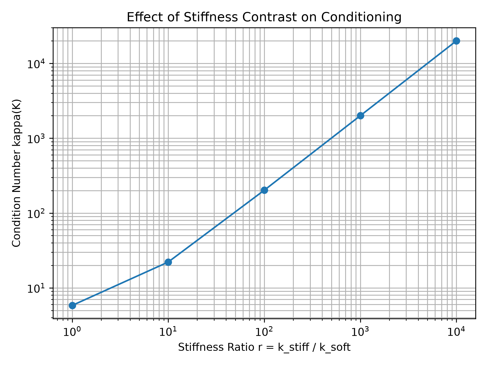
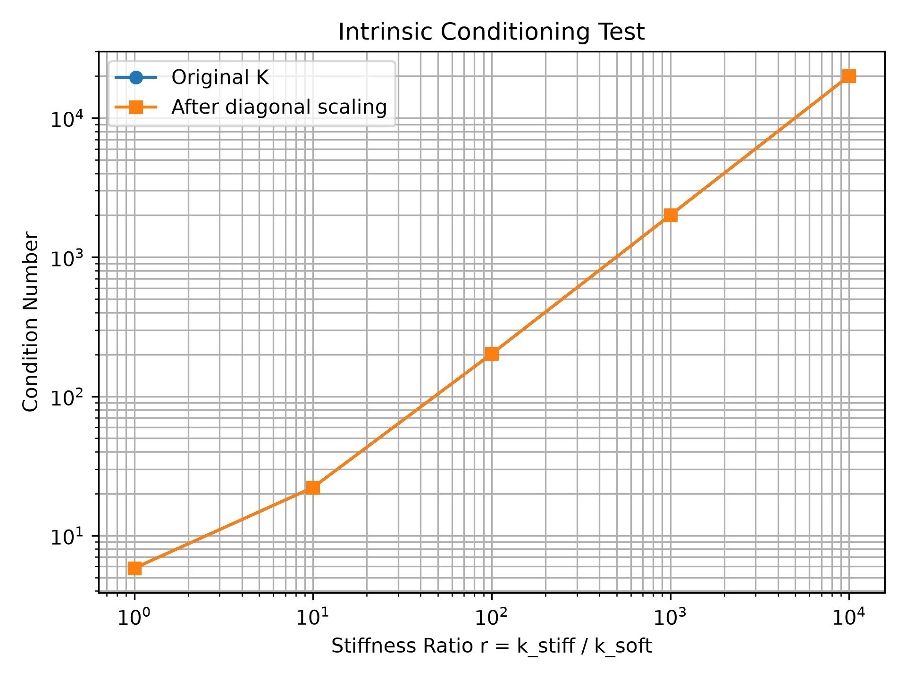
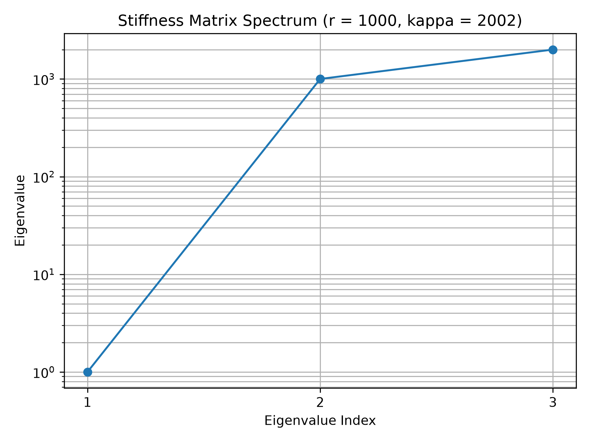
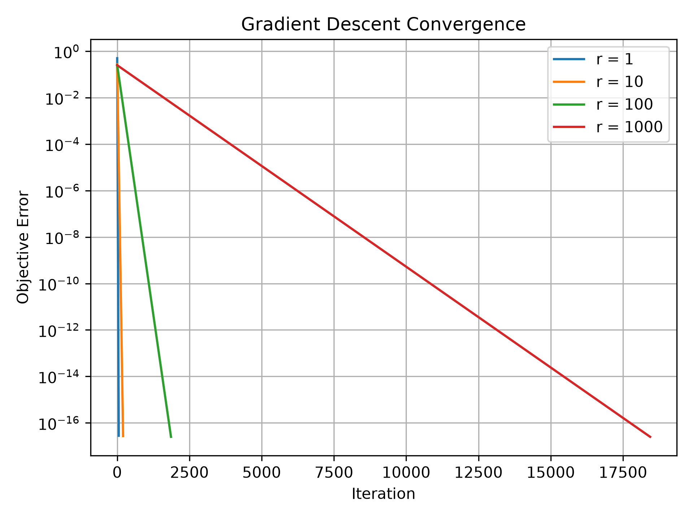
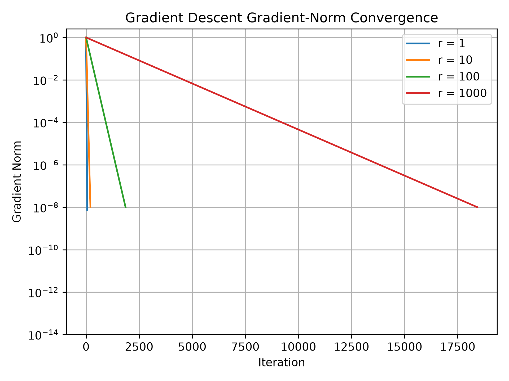
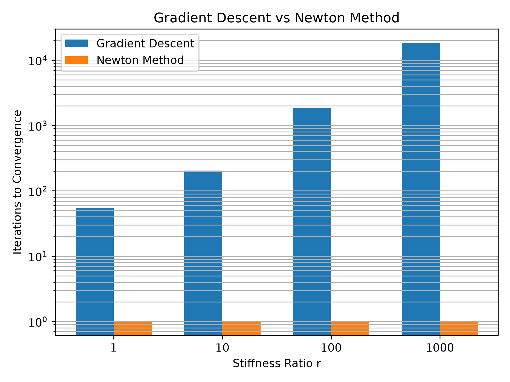

# Project II: Ill-Conditioning in a Mixed-Stiffness Spring System

## 1. Problem Identification and Motivation

Mechanical systems often contain components with significantly different stiffnesses. Examples include compliant mechanisms, structural supports, suspension components, and assemblies containing both flexible and rigid members. These differences in stiffness can create numerical difficulties when solving for the equilibrium configuration of the system.

For this project, we consider a one-dimensional chain of springs connected between two fixed supports. The system contains alternating soft and stiff springs, with movable nodes between the springs. External forces are applied to the nodes, causing the system to deform until it reaches mechanical equilibrium.

The equilibrium configuration can be found by minimizing the total potential energy of the spring system. When the difference between the stiff and soft spring constants becomes large, the resulting optimization problem becomes increasingly ill-conditioned. This provides a simple mechanical system for studying how ill-conditioning affects the convergence of optimization algorithms.

The primary parameter investigated in this project is the stiffness ratio

$$
r = \frac{k_{\text{stiff}}}{k_{\text{soft}}}.
$$

By increasing this ratio, we will investigate how stiffness contrast affects the condition number of the optimization problem and the convergence behavior of gradient descent. We will then apply an optimization method intended to reduce the negative effects of ill-conditioning and compare its performance with standard gradient descent.

## 2. Formulation

### 2.1 Physical Model and Design Variables

The system is modeled as a one-dimensional chain containing three movable nodes and four linear springs connected between two fixed supports. The springs alternate between soft and stiff members.

The displacement of each movable node is represented by

$$
\mathbf{x} =
\begin{bmatrix}
x_1 \\
x_2 \\
x_3
\end{bmatrix},
$$

where $x_i$ is the horizontal displacement of node $i$ from its unloaded position. These nodal displacements are the design variables of the optimization problem.

The spring constants are defined as

$$
k_1 = k_3 = k_{\text{soft}},
$$

$$
k_2 = k_4 = k_{\text{stiff}},
$$

with the stiffness ratio

$$
r = \frac{k_{\text{stiff}}}{k_{\text{soft}}}.
$$

The spring constants are treated as fixed parameters during each optimization problem. The ratio $r$ will be varied between experiments to study its effect on numerical conditioning.

### 2.1.1 Variable and Parameter Summary

| Symbol | Description | Units | Dimension | Type | Bounds / Role |
|---|---|---|---:|---|---|
| $x_1$ | Displacement of node 1 | displacement units | 1 | Continuous | Unbounded in the simplified linear model |
| $x_2$ | Displacement of node 2 | displacement units | 1 | Continuous | Unbounded in the simplified linear model |
| $x_3$ | Displacement of node 3 | displacement units | 1 | Continuous | Unbounded in the simplified linear model |
| $k_{\text{soft}}$ | Soft spring stiffness | force/displacement | 1 | Parameter | Fixed at 1 in the numerical study |
| $k_{\text{stiff}}$ | Stiff spring stiffness | force/displacement | 1 | Parameter | Varied through the stiffness ratio |
| $r$ | Stiffness ratio | dimensionless | 1 | Parameter | $1$ to $10{,}000$ |

The decision vector is

$$\mathbf{x}\in\mathbb{R}^3$$

and contains three continuous displacement variables.

The problem is an unconstrained, continuous, convex quadratic optimization problem. Because the stiffness matrix is symmetric positive definite for the tested cases, the objective has a unique global minimizer.

### 2.2 Objective Function

For a linear spring with stiffness $k$ and displacement $\Delta x$, the stored elastic potential energy is

$$
U_s = \frac{1}{2}k(\Delta x)^2.
$$

For the four-spring system, the total elastic energy is

$$
U_s(\mathbf{x}) =
\frac{1}{2}k_1x_1^2
+\frac{1}{2}k_2(x_2-x_1)^2
+\frac{1}{2}k_3(x_3-x_2)^2
+\frac{1}{2}k_4x_3^2.
$$

If external nodal forces are represented by

$$
\mathbf{f} =
\begin{bmatrix}
f_1 \\
f_2 \\
f_3
\end{bmatrix},
$$

the total potential energy of the system is

$$
\Pi(\mathbf{x}) = U_s(\mathbf{x})-\mathbf{f}^T\mathbf{x}.
$$

The optimization problem is therefore

$$
\boxed{
\min_{\mathbf{x}} \; \Pi(\mathbf{x})
}
$$

The minimum of the total potential energy corresponds to the mechanical equilibrium configuration of the spring system. Because the two end supports are fixed, the system has no rigid-body translation and no additional displacement constraints are required for this simplified model.

### 2.3 Matrix Formulation

The total potential energy can be written in quadratic matrix form as

$$\Pi(\mathbf{x}) = \frac{1}{2}\mathbf{x}^T K\mathbf{x} - \mathbf{f}^T\mathbf{x}$$

where $K$ is the stiffness matrix of the spring system. For the three-node, four-spring model,

$$
K =
\begin{bmatrix}
k_1+k_2 & -k_2 & 0 \\
-k_2 & k_2+k_3 & -k_3 \\
0 & -k_3 & k_3+k_4
\end{bmatrix}
$$

The diagonal entries represent the sum of the spring stiffnesses connected to each movable node. The off-diagonal entries represent coupling between adjacent nodes.

Taking the gradient of the objective gives

$$
\nabla \Pi(\mathbf{x}) = K\mathbf{x}-\mathbf{f}
$$

At the minimum-energy configuration,

$$
\nabla \Pi(\mathbf{x}^*)=0
$$

which gives

$$
K\mathbf{x}^*=\mathbf{f}
$$

Therefore, minimizing the total potential energy is equivalent to solving the mechanical equilibrium equations for the spring system.

The Hessian of the objective is

$$
H = \nabla^2\Pi(\mathbf{x}) = K
$$

Because the Hessian is equal to the stiffness matrix, the numerical conditioning of the optimization problem can be studied directly through the eigenvalues of $K$. For a symmetric positive-definite stiffness matrix, the 2-norm condition number is

$$
\kappa(K) =
\frac{\lambda_{\max}(K)}
{\lambda_{\min}(K)}
$$

This relationship will be used to investigate how increasing the stiffness contrast affects the conditioning of the optimization problem.

## 3. Ill-Conditioning Mechanism

This problem belongs to **Family A: multiscale physical parameters**. The mixed soft and stiff spring components cause the Hessian eigenvalues to span increasingly different scales as the stiffness ratio increases.

### 3.1 Small Numerical Verification Case

Before studying larger stiffness ratios, a small three-node system was used to verify the stiffness matrix formulation and numerical calculations.

For the initial case,

$$k_{\text{soft}} = 1$$

and

$$k_{\text{stiff}} = 10$$

giving a stiffness ratio of

$$r = \frac{k_{\text{stiff}}}{k_{\text{soft}}} = 10$$

The resulting stiffness matrix was

$$
K =
\begin{bmatrix}
11 & -10 & 0 \\
-10 & 11 & -1 \\
0 & -1 & 11
\end{bmatrix}
$$

The computed eigenvalues were approximately

$$
\lambda =
\begin{bmatrix}
0.9501,\ 11.0000,\ 21.0499
\end{bmatrix}
$$

Using the largest and smallest eigenvalues, the 2-norm condition number was

$$\kappa(K) = \frac{21.0499}{0.9501} \approx 22.15$$

For an external force vector

$$
\mathbf{f} =
\begin{bmatrix}
0 \\
1 \\
0
\end{bmatrix}
$$

the equilibrium displacement was

$$
\mathbf{x}^* =
\begin{bmatrix}
0.50 \\
0.55 \\
0.05
\end{bmatrix}
$$

Substituting this solution into the gradient expression

$$\nabla\Pi(\mathbf{x}) = K\mathbf{x}-\mathbf{f}$$

produced values on the order of $10^{-16}$, which is effectively zero within floating-point precision. This verifies that the computed displacement corresponds to the minimum-energy equilibrium configuration.

This initial case confirms that the numerical implementation is consistent with the analytical stiffness matrix formulation. The next step is to systematically increase the stiffness ratio and measure how the eigenvalue spread and condition number change.

### 3.2 Effect of Stiffness Ratio on Conditioning

To investigate how stiffness contrast affects the numerical conditioning of the system, the stiffness ratio

$$r = \frac{k_{\text{stiff}}}{k_{\text{soft}}}$$

was varied from $1$ to $10{,}000$ while keeping

$$k_{\text{soft}} = 1$$

constant.

The resulting condition numbers were approximately:

| Stiffness Ratio $r$ | Condition Number $\kappa(K)$ |
|---:|---:|
| 1 | 5.83 |
| 10 | 22.15 |
| 100 | 202.02 |
| 1,000 | 2,002.00 |
| 10,000 | 20,002.00 |

The condition number increases rapidly as the stiffness contrast increases. For the larger stiffness ratios tested, the observed behavior is approximately proportional to the stiffness ratio, with

$$\kappa(K) \approx 2r$$

This indicates that increasing the difference between the stiff and soft spring constants produces an increasingly ill-conditioned optimization problem.

The log-log plot shows that the condition number grows nearly linearly with the stiffness ratio over the larger values of $r$. Physically, this means that the energy landscape develops increasingly different curvatures in different directions as the contrast between the stiff and soft members increases.

### 3.3 Intrinsic Conditioning Test

A diagonal, or Jacobi, scaling test was performed to determine whether the large condition number was caused only by poor numerical scaling of the design variables.

The scaled stiffness matrix was defined as

$$K_{\text{scaled}} = D^{-1/2} K D^{-1/2}$$

where

$$D = \text{diag}(K)$$

For the selected alternating spring system, the diagonal entries of the stiffness matrix are equal to $1+r$. Therefore,

$$D = (1+r)I$$

and the scaled stiffness matrix becomes

$$K_{\text{scaled}} = \frac{1}{1+r}K$$

Multiplying a matrix by a scalar multiplies all of its eigenvalues by the same factor. Therefore, the ratio between the largest and smallest eigenvalues remains unchanged, giving

$$\kappa(K_{\text{scaled}}) = \kappa(K)$$

The numerical results confirm this behavior. The original and diagonally scaled condition numbers overlap across the tested stiffness ratios.

This result shows that the poor conditioning is not caused only by trivial coordinate scaling. Instead, it arises from the structure and coupling of the mixed-stiffness spring system. Therefore, the observed ill-conditioning is intrinsic to the selected problem formulation.

## 4. Effect of Ill-Conditioning

### 4.1 Eigenvalue Spectrum

The required D1 spectrum diagnostic was evaluated for a representative ill-conditioned case with

$$r = 1000.$$

The stiffness matrix eigenvalues span from a relatively small curvature direction to a much larger curvature direction, producing

$$\kappa(K) \approx 2002.$$

The large separation between the smallest and largest eigenvalues shows directly why the energy landscape is strongly elongated and why a first-order method such as gradient descent converges slowly.

### 4.2 Baseline Gradient Descent Performance

To evaluate the practical effect of ill-conditioning, standard gradient descent was applied to the spring-system objective

$$\Pi(\mathbf{x}) = \frac{1}{2}\mathbf{x}^T K\mathbf{x} - \mathbf{f}^T\mathbf{x}$$

using the gradient

$$\nabla\Pi(\mathbf{x}) = K\mathbf{x}-\mathbf{f}$$

The same initial point and stopping tolerance were used for each stiffness ratio. A constant step size based on the minimum and maximum eigenvalues of the stiffness matrix was selected as

$$\alpha = \frac{2}{\lambda_{\min}+\lambda_{\max}}$$

This step size provides a reasonable comparison because it accounts for the curvature of each quadratic problem rather than intentionally using a poor learning rate.

The measured convergence results were:

| Stiffness Ratio $r$ | Condition Number $\kappa(K)$ | Gradient Descent Iterations |
|---:|---:|---:|
| 1 | 5.83 | 55 |
| 10 | 22.15 | 205 |
| 100 | 202.02 | 1,862 |
| 1,000 | 2,002.00 | 18,440 |

The number of iterations increases substantially as the condition number increases. For the larger tested cases, the iteration count is approximately proportional to the condition number.

For example,

$$\frac{18{,}440}{2{,}002} \approx 9.21$$

while

$$\frac{1{,}862}{202.02} \approx 9.22$$

showing that, for the selected stopping tolerance and step-size rule, the iteration requirement scales approximately linearly with the condition number.

These results demonstrate the practical consequence of ill-conditioning. As the stiffness contrast increases, the energy landscape develops increasingly different curvatures along different directions. Gradient descent therefore requires many more iterations to reach the same convergence tolerance, even when a curvature-based step size is used.

## 5. Proposed Solution and Demonstration

### 5.1 Newton's Method as a Remedy

The baseline gradient descent results showed that convergence becomes much slower as the condition number increases. To reduce the effect of this ill-conditioning, Newton's method was applied to the same spring-system optimization problem.

For the quadratic objective

$$\Pi(\mathbf{x}) = \frac{1}{2}\mathbf{x}^T K\mathbf{x} - \mathbf{f}^T\mathbf{x}$$

the gradient is

$$\nabla\Pi(\mathbf{x}) = K\mathbf{x}-\mathbf{f}$$

and the Hessian is

$$H = K$$

Newton's method updates the design variables according to

$$\mathbf{x}_{k+1} = \mathbf{x}_k - H^{-1}\nabla\Pi(\mathbf{x}_k)$$

Since $H=K$ for this problem,

$$\mathbf{x}_{k+1} = \mathbf{x}_k - K^{-1}(K\mathbf{x}_k-\mathbf{f})$$

which simplifies to

$$\mathbf{x}_{k+1} = K^{-1}\mathbf{f}$$

Therefore, for this exact quadratic objective, Newton's method reaches the equilibrium solution in a single iteration when the exact Hessian is used.

### 5.2 Gradient Descent vs. Newton's Method

The two methods were compared using the same spring systems and stiffness ratios used in the baseline convergence study.

| Stiffness Ratio $r$ | Condition Number $\kappa(K)$ | Gradient Descent Iterations | Newton Iterations |
|---:|---:|---:|---:|
| 1 | 5.83 | 55 | 1 |
| 10 | 22.15 | 205 | 1 |
| 100 | 202.02 | 1,862 | 1 |
| 1,000 | 2,002.00 | 18,440 | 1 |

The results show that the number of gradient descent iterations increases rapidly as the problem becomes more ill-conditioned. In contrast, Newton's method reaches the exact quadratic solution in one iteration for every tested stiffness ratio.

This comparison demonstrates how curvature information can dramatically improve optimization performance for an ill-conditioned quadratic problem. Gradient descent uses only first-order information and therefore becomes increasingly sensitive to the large difference between the steep and flat directions of the energy landscape. Newton's method uses the Hessian directly and compensates for these differences in curvature.

### 5.3 Limitations of the Remedy

The one-step convergence observed here is a special property of the quadratic spring-system objective with a constant, exactly known Hessian. Newton's method is not expected to converge in one iteration for a general nonlinear optimization problem.

In larger engineering problems, forming, storing, and factorizing the Hessian can also be computationally expensive. Therefore, methods such as quasi-Newton methods, conjugate-gradient methods, or preconditioning may be more practical for large-scale systems.

For the present project, Newton's method provides a clear demonstration that using curvature information can eliminate the slow convergence observed with gradient descent on the ill-conditioned spring system.

## 6. Assumptions and Simplifications

### 6.1 Modeling Assumptions

The spring system used in this project is intentionally simplified so that the effect of ill-conditioning can be isolated and studied clearly.

The main assumptions are:

- The system is one-dimensional, so each movable node has only one displacement degree of freedom.
- All springs are linear and follow Hooke's law.
- Deformations are assumed to be small enough that geometric nonlinearities can be neglected.
- The two end supports are fixed.
- Spring masses and node masses are neglected because the problem is treated as a static equilibrium problem rather than a dynamic system.
- The applied external force is deterministic and does not change during each optimization problem.
- The soft spring stiffness is held fixed at $k_{\text{soft}}=1$, while the stiff spring stiffness is varied through the ratio

$$r = \frac{k_{\text{stiff}}}{k_{\text{soft}}}$$

- The optimization objective is exactly quadratic, causing the Hessian to remain constant and equal to the stiffness matrix.

### 6.2 Numerical Assumptions

The stiffness matrix is symmetric positive definite for the tested cases, allowing the condition number to be computed as the ratio of the largest to smallest eigenvalue.

The exact equilibrium solution

$$K\mathbf{x}^*=\mathbf{f}$$

is used as a reference solution when evaluating optimization error.

For the gradient descent experiments, the same initial point and relative stopping tolerance are used for all tested stiffness ratios. The step size is selected using

$$\alpha = \frac{2}{\lambda_{\min}+\lambda_{\max}}$$

so that the comparison focuses on the effect of conditioning rather than intentionally using a poor learning rate.

Objective-error values below approximately $10^{-14}$ are not interpreted physically because floating-point roundoff becomes significant near machine precision. The convergence plots therefore use a numerical floor to avoid displaying roundoff noise.

### 6.3 Scope of the Results

The results demonstrate the effect of ill-conditioning for a small mixed-stiffness spring system. The same qualitative behavior can occur in larger structural systems containing components with widely different stiffnesses, but the exact condition numbers and convergence rates depend on the geometry, connectivity, loading, and solver used.

Newton's one-step convergence in this project is a consequence of the exact quadratic objective and constant Hessian. For general nonlinear or large-scale engineering optimization problems, Newton's method may require multiple iterations and can be expensive because of Hessian formation and factorization.

The purpose of this simplified model is therefore not to represent a complete real structure, but to provide a clear mechanical example showing the relationship between stiffness contrast, ill-conditioning, and optimization convergence.
